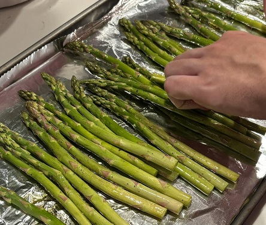

# Asparagus

Cook-time: 45min

## Ingredients

- Bundle of asparagus
- Black pepper
- Oil

## Recipe

- Preheat oven to 450F
- In a wide bowl, cover asparagus in oil and black pepper
- Place a sheet of aluminum foil on a cookie sheet and then lay down the asparagus
- Cook in oven for 15-20min

