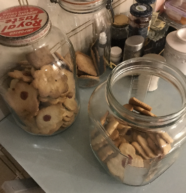

# Galletas de Mantequilla con Bocadillo de Elida

## Ingredients

- 2lbs of unbleached all-purpose flour
- 2.5 cups of white sugar
- 5 bars of unsalted butter
- 3 tsp. of baking powder
- 2 tsp. of vanilla extract
- 0.5 tsp. of salt
- 5 eggs

## Instructions

1. Mix 6 cups of flour with baking powder and salt, set aside
2. In a large bowl blend butter until creamy. Add sugar, vanilla, and eggs. Mix well
3. Add flour mix, one cup at a time to the batter and blend. As more flour mix is added, begin to
   knead by hand until smooth and not sticky (add flour as needed from remaining cup of flour)
4. Put in fridge
5. Sprinkle tabletop with flour and begin to roll dough to thin layer (about 1/8 in thick)
6. Cut with cookie-cutters and place on baking sheet (can use with parchment paper)
7. Add chopped bocadillo to each cookie
8. Bake at 350F for at least 14 minutes
