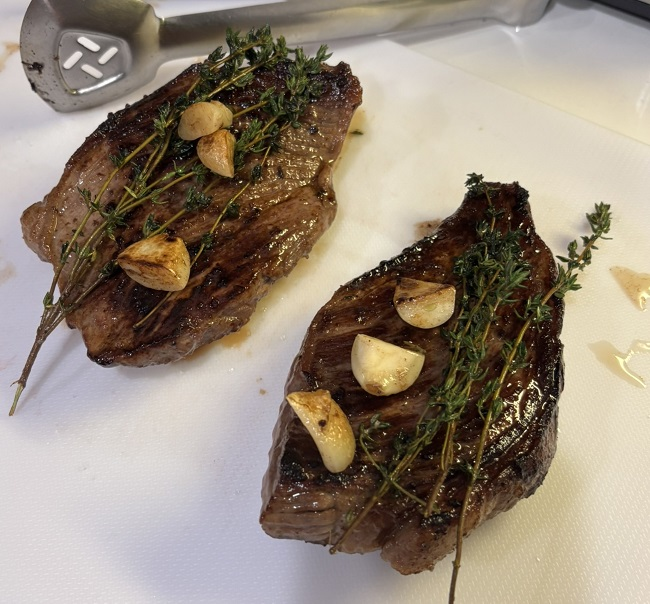
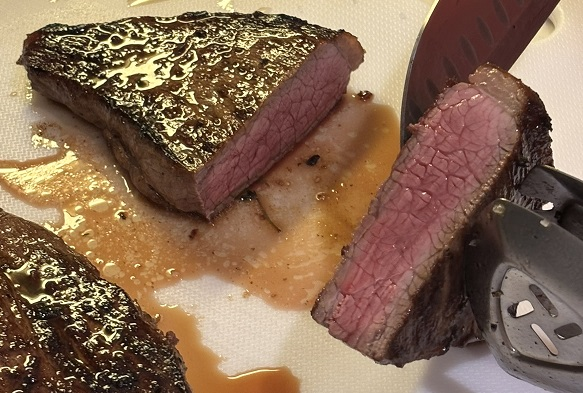

# Steak and Mushrooms

## Ingredients

- 10oz (0.62lb) of steak at room temp (ribeye, NY strip, or filet mignon recommended)
- 1-2 tablespoons oil (high smoke point: grapeseed, canola, or avocado oil)
- 2 cloves of garlic (cut into halves)
- 3-4 sprigs fresh thyme
- 1 tablespoon of butter, room temp
- Kosher salt or sea salt (to taste)
- Freshly ground black pepper
- 1 cup of chopped mushrooms

## Recipe

### Prep

- Take steaks out of fridge for 20-30min to reach room temperature
- Cut excessive fat around edges as needed (leave some for flavor)
- Pat steaks completely dry with paper towels (crucial for good sear)
- Preheat a large stainless steel or cast iron pan over medium-high heat for 3-4min
- Add oil and heat until it shimmers (but not smoking)
- Season one side of steak generously with salt just before cooking

### Sear

- Place seasoned side down in pan to sear for 2-3min (don't move the steak)
- Season the top side with salt while first side sears
- Flip steak and sear second side for 2-3min
- Use tongs to sear all edges for about 30s each
- Check internal temperature: 120°F (rare), 130°F (medium-rare), 140°F (medium)
- Reduce heat to low

### Baste

- Add butter, garlic, and thyme to the pan
- Tilt pan and use a spoon to continuously baste steaks with melted butter for 1-2min
- Rub cut side of garlic cloves on top of steak for extra flavor

### Rest

- Remove steak and rest on a cutting board or plate for 5-10min (allows juices to redistribute), note that temperature will rise 5°F during resting
- Add freshly cracked black pepper after resting
- Optional: top with flaky sea salt

## Doneness Guide (Internal Temp)

- Rare: 120-125°F
- Medium-Rare: 130-135°F (recommended)
- Medium: 135-145°F
- Medium-Well: 145-155°F
- Well Done: 155°F+ (not recommended)

